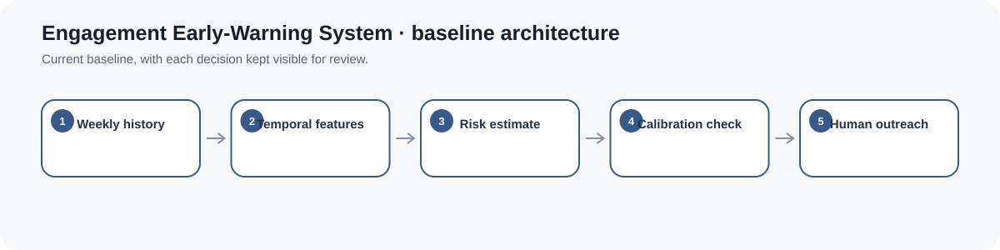
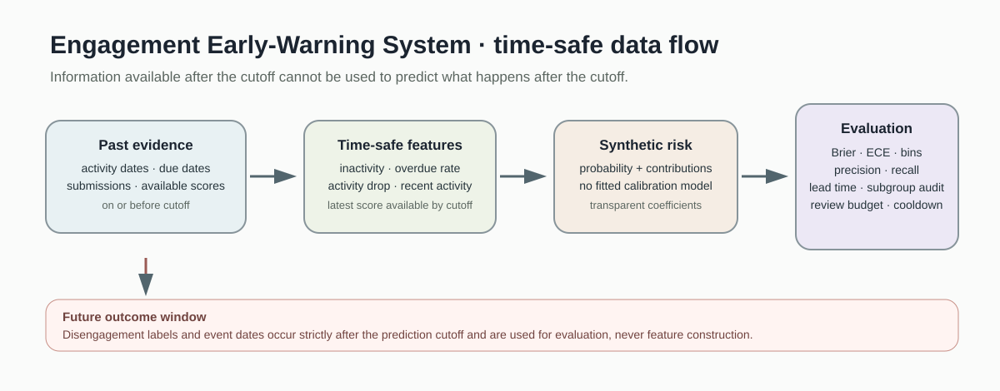
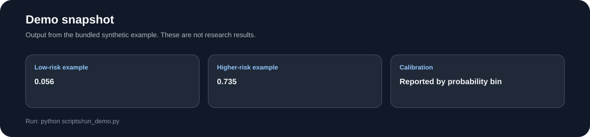
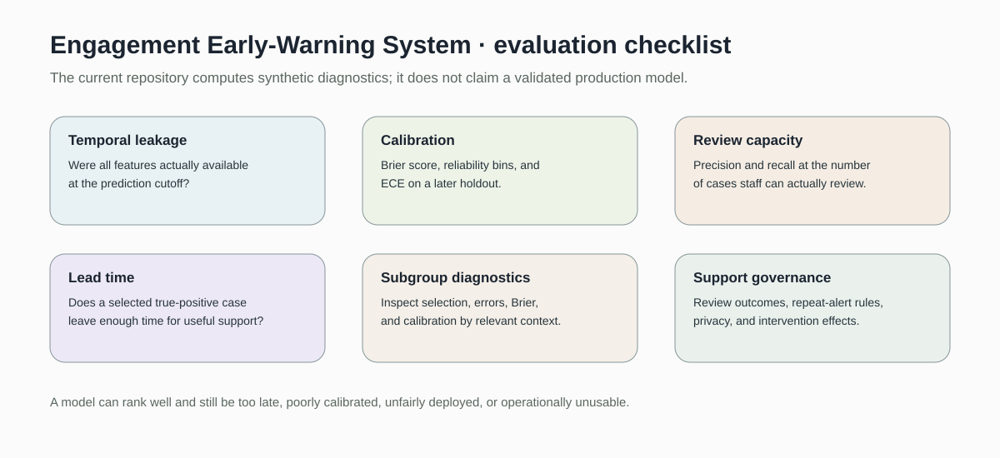

# Engagement Early-Warning System

> Time-safe learner engagement early-warning analytics with leakage guards, calibration review, review-capacity thresholds, lead-time analysis, and subgroup diagnostics.

[](https://github.com/devissaputra/engagement_early_warning/actions/workflows/ci.yml)



**Area:** AI in Education · Learning Analytics · Student Support  
**Status:** working research prototype  
**Author:** Devis Wawan Saputra

## What this project is for

An early-warning system is only useful if it answers a genuinely early question:

> What support signal could have been produced at this prediction date using only information available at that time?

This repository implements that boundary directly.

The prototype constructs cutoff-safe engagement features, calculates a transparent synthetic risk probability, evaluates predictions under a realistic staff review budget, checks probability quality, measures lead time, audits subgroup diagnostics, and leaves support decisions to a human reviewer.

The bundled coefficients and data are synthetic.

This repository does **not** establish predictive validity for real learners.

## Core design rule

**Future information cannot become a feature.**



A prediction case separates:

1. dated evidence available by the prediction cutoff
2. a prediction made at that cutoff
3. a future outcome window beginning strictly after the cutoff

Examples:

- an activity event tomorrow cannot help today's prediction
- a task not yet due cannot count as overdue
- a grade not released yet cannot be used retrospectively
- a later disengagement event belongs to evaluation, not feature construction

## Time-safe feature construction

`construct_time_safe_features()` accepts:

- dated activity events
- task due dates
- task submission dates
- assessment-availability dates
- assessment scores
- prediction cutoff

It derives:

- inactive days
- normalized inactivity
- tasks due by the cutoff
- tasks overdue at the cutoff
- recent activity count
- previous-window activity count
- activity-drop ratio
- recent-activity ratio
- latest assessment score actually available by the cutoff

A future activity event is rejected.

A future assessment score remains unavailable.

A submission after the cutoff does not rewrite what was known at prediction time.

## Transparent synthetic risk model

The current baseline uses five normalized inputs:

- inactivity ratio
- overdue-task rate
- activity-drop ratio
- recent-activity ratio
- recent assessment score when available

The coefficients are hand-authored and visible in `DEFAULT_COEFFICIENTS`.

`risk_from_features()` returns:

- probability
- linear score
- feature values
- coefficient values
- per-feature score contributions
- an explicit `synthetic_coefficients=True` flag

This is a software and evaluation baseline, not a fitted production model.

## Why forum activity is not a universal feature

The original prototype directly treated more forum posts as lower disengagement risk.

That assumption has been removed from the main model.

Forum activity can still appear as a dated activity event, but it is not given a universal protective coefficient.

Learners can be engaged through assignments, readings, group work, offline study, or other course activities.

## Future outcome window

Every evaluated prediction specifies:

- prediction week
- prediction cutoff
- outcome-window start
- outcome-window end
- future disengagement label
- future event date for positive cases

The outcome window must begin after the prediction cutoff.

Positive event dates must fall inside the future outcome window.

A real study must define “disengagement” precisely before fitting or evaluating a model.

## Calibration diagnostics

The repository implements:

- reliability/calibration bins
- Brier score
- expected calibration error

These inspect probability quality.

The repository does **not** fit a calibration transform and therefore does not claim that the synthetic score is an empirically calibrated model.

## Human review capacity

Support teams rarely have unlimited review capacity.

`review_queue()` sorts eligible cases by risk and selects only the highest-risk cases up to a declared review budget.

This produces a cohort-specific operational threshold.

That threshold is not a universal definition of “at risk.”

## Early-warning evaluation

`evaluate_review_budget()` reports:

- true positives
- false positives
- false negatives
- true negatives
- precision
- recall
- false-positive rate
- false-negative rate
- operational risk threshold
- lead time for selected true-positive cases
- Brier score
- expected calibration error
- reliability bins

Lead time matters because an accurate alert that arrives after useful support is possible is not a useful early warning.

## Repeat-alert control

A learner reviewed recently can be temporarily suppressed through an alert cooldown.

This demonstrates one basic alert-fatigue control.

A real support workflow also needs case status, escalation, closure, and override rules.

## Subgroup diagnostics

`subgroup_audit()` reports descriptive group-level:

- prevalence
- selected fraction
- precision
- recall
- false-positive rate
- false-negative rate
- Brier score
- expected calibration error

These diagnostics do not prove fairness.

They help identify differences that require contextual and governance review.

## Temporal holdout

`temporal_holdout()` divides prediction cases by prediction date.

This is more deployment-like than randomly mixing early and later course states.

For a real fitted model, all fitting, tuning, and probability calibration should be completed using earlier data before final evaluation on later data.

## Synthetic demo



The bundled demonstration contains:

- 24 synthetic prediction cases
- two prediction dates
- two synthetic evaluation groups
- a review budget of six cases
- future outcome windows
- future event dates for positive cases
- calibration diagnostics
- precision and recall at review capacity
- lead-time calculations
- subgroup diagnostics
- temporal holdout
- one raw-history example demonstrating cutoff-safe feature construction

All results are synthetic.

They exist to exercise the software path, not to advertise model performance.

## Data files

`data/sample.csv`  
Twenty-four synthetic prediction cases.

`data/history_example.json`  
A small dated history used to demonstrate feature availability at a prediction cutoff.

`data/README.md`  
Timing semantics, schema, leakage rules, subgroup cautions, and real-data governance guidance.

## Run the project

```bash
git clone https://github.com/devissaputra/engagement_early_warning.git
cd engagement_early_warning

python scripts/run_demo.py
python -m unittest discover -s tests -v
```

The current implementation uses only the Python standard library.

## Core API

`construct_time_safe_features(...)`  
Constructs prediction features while rejecting or excluding future information.

`risk_from_features(...)`  
Computes the transparent synthetic risk score and contribution breakdown.

`risk_probability(...)`  
Backward-compatible wrapper for the original four-input demonstration.

`validate_prediction_case(...)`  
Validates prediction timing, future outcome timing, probability, and event dates.

`calibration_bins(...)`  
Builds reliability bins.

`brier_score(...)`  
Computes mean squared probability error.

`expected_calibration_error(...)`  
Summarizes probability-bin calibration gaps.

`review_queue(...)`  
Builds a capacity-constrained human-review queue with optional alert cooldown.

`evaluate_review_budget(...)`  
Computes operational error, lead-time, and calibration diagnostics.

`subgroup_audit(...)`  
Computes descriptive group error and probability-quality diagnostics.

`temporal_holdout(...)`  
Creates an earlier-development / later-holdout split by prediction date.

`contribution_explanation(...)`  
Explains the synthetic probability using the components actually used by the scorer.

## Evaluation checklist



Before claiming a useful early-warning system, investigate:

1. **Temporal leakage** — was every feature actually available at prediction time?
2. **Calibration** — do predicted probabilities align with later outcomes?
3. **Review capacity** — what precision and recall occur at the number of cases staff can review?
4. **Lead time** — do true-positive alerts leave enough time for support?
5. **Subgroup diagnostics** — are error or calibration patterns uneven?
6. **Support governance** — what happens after an alert, and how are repeat alerts controlled?

## Research context

The repository is grounded in educational early-warning and learning-analytics work, including Course Signals, the Open Academic Analytics Initiative, and research on algorithmic bias in education.

See `docs/related_work.md`.

The implementation is deliberately simpler than a production predictive system: no learned coefficients, deep model, embeddings, or automated intervention.

## Responsible use

A risk probability must not be interpreted as motivation, ability, intent, character, or certainty of failure.

Low LMS activity can reflect:

- course design
- offline study
- group work
- accessibility accommodations
- connectivity constraints
- illness
- platform problems
- other legitimate learning patterns

The prototype should not be used alone for:

- grading
- discipline
- admissions
- scholarship removal
- academic-integrity enforcement
- psychological or medical diagnosis
- employment decisions
- covert surveillance

See `docs/ethics_and_risks.md`.

## Limitations

The current baseline:

- uses synthetic hand-authored coefficients
- uses a small feature set
- does not fit a model
- does not fit a probability-calibration transform
- assumes timestamps are accurate
- does not model LMS ingestion delays
- does not model rich missingness
- does not learn course-specific activity patterns
- does not estimate statistical uncertainty
- does not estimate intervention effects
- does not model feedback loops after support
- does not validate fairness from the synthetic subgroup audit

The repository demonstrates how an early-warning study can be structured safely and transparently before real predictive claims are made.

## Repository map

```text
.
├── .github/workflows/ci.yml
├── assets/
│   ├── architecture.svg
│   ├── data_flow.svg
│   ├── demo_snapshot.svg
│   └── evaluation_dashboard.svg
├── data/
│   ├── README.md
│   ├── history_example.json
│   └── sample.csv
├── docs/
│   ├── ethics_and_risks.md
│   ├── related_work.md
│   └── research_protocol.md
├── reports/model_card.md
├── scripts/run_demo.py
├── src/engagement_early_warning/
│   ├── __init__.py
│   └── core.py
├── tests/test_core.py
├── .gitignore
├── CITATION.cff
├── LICENSE
├── pyproject.toml
├── requirements.txt
└── README.md
```

## Research path

A stronger empirical version would:

1. define a concrete future support outcome
2. audit raw event availability and ingestion delays
3. pre-register prediction checkpoints
4. build development and later temporal-holdout cohorts
5. fit a transparent baseline on earlier data
6. compare with simple inactivity and overdue-task rules
7. fit probability calibration only on development data
8. evaluate Brier score, calibration, precision, recall, and lead time on later data
9. test realistic instructor/support review budgets
10. document alert outcomes and repeat-alert behavior
11. examine subgroup diagnostics with privacy safeguards
12. use an appropriate causal design if evaluating whether outreach itself improves outcomes

## Citation and license

`CITATION.cff` contains the software citation.

Code and original SVG visuals use the MIT License. External datasets and published instruments retain their own licenses and usage requirements.
